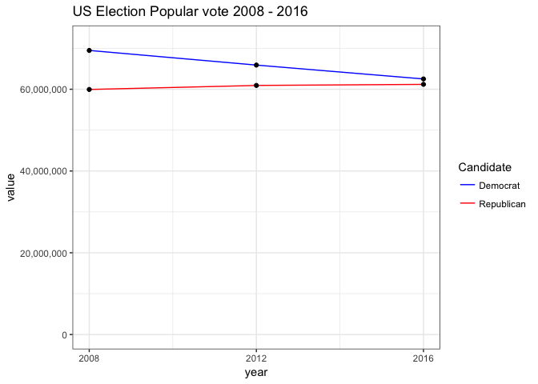

The y-axis: to zero or not to zero?
================
Neil Saunders
21/11/2016

# Introduction

I don’t “do politics” at this blog, but I’m always happy to do charts.
[Here’s
one](https://twitter.com/yanagiz/status/796382521688727552/photo/1)
that’s been doing the rounds on Twitter recently.

What’s the first thing that comes into your mind on seeing that chart?
It seems that there are two main responses:

1.  Wow, what happened to all those Democrat voters between 2008 and
    2016?
2.  Wow, that’s misleading, it makes it look like Democrat support
    almost halved between 2008 and 2016

The question then is: when (if ever) is it acceptable to start a y-axis
at a non-zero value?

# What would ggplot2 say?

Let’s get some data into ggplot2 and find out. There’s lots of
publicly-available election data; I’m using Wikipedia pages such as
[this one for the 2008 US
election](https://en.wikipedia.org/wiki/United_States_presidential_election,_2008).

``` r
library(tidyr)
library(ggplot2)
library(scales)

# popular vote, electoral college votes and turnout 1980-2016
elections <- data.frame(year = c(1980, 1984, 1988, 1992, 1996, 2000, 2004, 2008, 
    2012, 2016), Rep.pop = c(43903230, 54455472, 48886097, 39104550, 39197469, 
    50456002, 62040610, 59948323, 60933504, 61201031), Dem.pop = c(35480115, 
    37577352, 41809074, 44909806, 47401185, 50999897, 59028444, 69498516, 65915794, 
    62523126), Rep.ec = c(489, 525, 426, 168, 159, 271, 286, 173, 206, 306), 
    Dem.ec = c(49, 13, 111, 370, 379, 266, 251, 365, 332, 232), turnout = c(52.6, 
        53.3, 50.2, 55.2, 49, 51.2, 56.7, 58.2, 54.9, 53.7))

# Let’s tidy that up a little so as the data are in “long format” with one
# variable per column, one value per variable:

elections.1 <- gather(elections, key, value, -year)
elections.2 <- separate(elections.1, key, into = c("variable", "vote"), sep = "\\.")
```

    ## Warning: Expected 2 pieces. Missing pieces filled with `NA` in 10 rows [41,
    ## 42, 43, 44, 45, 46, 47, 48, 49, 50].

Now we try to replicate the chart seen on
Twitter.

``` r
ggplot(subset(elections.2, vote == "pop" & year > 2004), aes(year, value)) + 
    geom_bar(aes(fill = variable), stat = "identity", position = "dodge") + 
    scale_x_continuous(breaks = seq(1980, 2016, 4)) + scale_fill_manual(values = c("blue", 
    "red"), labels = c("Democrat", "Republican"), name = "Candidate") + scale_y_continuous(labels = comma) + 
    theme_bw() + labs(title = "US Election Popular vote 2008 - 2016")
```

<!-- -->

ggplot2 by default starts the y-axis at zero when the chart is a bar
chart. To replicate the Twitter chart, we add some extra options to
scale\_y\_continuous.

``` r
ggplot(subset(elections.2, vote == "pop" & year > 2004), aes(year, value)) + 
    geom_bar(aes(fill = variable), stat = "identity", position = "dodge") + 
    scale_x_continuous(breaks = seq(1980, 2016, 4)) + scale_fill_manual(values = c("blue", 
    "red"), labels = c("Democrat", "Republican"), name = "Candidate") + scale_y_continuous(labels = comma, 
    limits = c(5.2e+07, 7.2e+07), oob = rescale_none) + theme_bw() + labs(title = "US Election Popular vote 2008 - 2016")
```

<!-- -->

There seem to be two reactions to this chart. One is that it’s effective
in showing the decline in the Democrat popular vote since 2008, whilst
the Republican vote has stayed relatively stable. The other is that by
truncating the y-axis, the chart misleads people into thinking that the
Democrat vote in 2016 is around 60% that of 2008. To be honest, I can
see both points of view. Personally, my eye is drawn to the absolute
values on the y-axis, but perhaps that is just me (and others like me).

[This
article](http://qz.com/418083/its-ok-not-to-start-your-y-axis-at-zero/)
tells us that “it’s OK not to start your y-axis at zero”, but then
states that “column and bar charts should always have zeroed axes”. They
use [a chart from the Twitter
IPO](http://qz.com/131891/misleading-chart-twitter-twtr-used-in-its-ipo-filing/)
as an example.

If you were waiting for the obligatory bad-mouthing of Excel, look no
further than [a follow-up Tweet by the chart
author](https://twitter.com/yanagiz/status/797064142804963329).

Onwards. What if we use a line chart
instead?

``` r
ggplot(subset(elections.2, vote == "pop" & year > 2004), aes(year, value)) + 
    geom_line(aes(color = variable)) + geom_point() + scale_x_continuous(breaks = seq(1980, 
    2016, 4)) + scale_color_manual(values = c("blue", "red"), labels = c("Democrat", 
    "Republican"), name = "Candidate") + scale_y_continuous(labels = comma) + 
    theme_bw() + labs(title = "US Election Popular vote 2008 - 2016")
```

<!-- -->

Now ggplot2 thinks that it’s fine to use a non-zero y-axis. The eye no
longer compares absolute heights. How does the line chart look if we
force the y-axis back to starting at
zero?

``` r
ggplot(subset(elections.2, vote == "pop" & year > 2004), aes(year, value)) + 
    geom_line(aes(color = variable)) + geom_point() + scale_x_continuous(breaks = seq(1980, 
    2016, 4)) + scale_color_manual(values = c("blue", "red"), labels = c("Democrat", 
    "Republican"), name = "Candidate") + scale_y_continuous(labels = comma, 
    limits = c(0, 7.2e+07)) + theme_bw() + labs(title = "US Election Popular vote 2008 - 2016")
```

<!-- -->

I think the blue decline is still apparent. The main issue with this one
for me is not any attempt to mislead, just a lot of wasted white space.

# What would Tufte say?

A common response is to ask what Tufte would say. You can [read what he
says
here](http://www.edwardtufte.com/bboard/q-and-a-fetch-msg?msg_id=00003q).
In that particular quote he says the y-axis should reflect the range of
the data and had nothing specific to say regarding bar charts. His last
sentence is telling:

*Instead, for context, show more data
horizontally\!*

``` r
ggplot(subset(elections.2, vote == "pop"), aes(year, value)) + geom_line(aes(color = variable)) + 
    geom_point() + scale_x_continuous(breaks = seq(1980, 2016, 4)) + scale_color_manual(values = c("blue", 
    "red"), labels = c("Democrat", "Republican"), name = "Candidate") + scale_y_continuous(labels = comma) + 
    theme_bw() + labs(title = "US Election Popular vote 1980 - 2016")
```

<!-- -->

And indeed, it is interesting to add more elections starting from the
year 1980.

# Some additional analysis

Plotting absolute numbers over time can be misleading, since the total
and voting population of the US may vary considerably over 10 elections.
We can use the turnout to estimate the total voting population and in
turn, the percentage of the total by Democrat and Republican vote. We
can also calculate the change in popular vote for each party as a
percentage of the previous election.

``` r
# as % of voting population
elections$total <- (100/elections$turnout) * (elections$Rep.pop + elections$Dem.pop)
elections$Dem.poppc <- 100 * (elections$Dem.pop/elections$total)
elections$Rep.poppc <- 100 * (elections$Rep.pop/elections$total)

# as % of previous election very ugly code, not optimised!
for (i in 2:nrow(elections)) {
    elections$dem.pc[i] <- 100 * (elections$Dem.pop[i] - elections$Dem.pop[i - 
        1])/elections$Dem.pop[i - 1]
    elections$rep.pc[i] <- 100 * (elections$Rep.pop[i] - elections$Rep.pop[i - 
        1])/elections$Rep.pop[i - 1]
}


elections.1 <- gather(elections, key, value, -year)
elections.2 <- separate(elections.1, key, into = c("party", "vote", sep = "\\."))
```

    ## Warning: Expected 3 pieces. Missing pieces filled with `NA` in 100 rows [1,
    ## 2, 3, 4, 5, 6, 7, 8, 9, 10, 11, 12, 13, 14, 15, 16, 17, 18, 19, 20, ...].

## Voters as a percentage of the voting population

``` r
ggplot(subset(elections.2, vote == "poppc"), aes(year, value)) + geom_line(aes(color = party)) + 
    geom_point() + scale_x_continuous(breaks = seq(1980, 2016, 4)) + scale_color_manual(values = c("blue", 
    "red"), labels = c("Democrat", "Republican"), name = "Candidate") + scale_y_continuous(labels = comma) + 
    theme_bw() + labs(title = "US Election Popular vote 1980 - 2016 as % of voting population")
```

<!-- -->

## Percentage change in voters compared with previous election

``` r
ggplot(subset(elections.2, vote == "pc"), aes(year, value)) + geom_bar(aes(fill = party), 
    stat = "identity", position = "dodge") + scale_fill_manual(values = c("blue", 
    "red"), labels = c("Democrat", "Republican"), name = "Candidate") + theme_bw() + 
    scale_x_continuous(breaks = seq(1984, 2016, 4)) + labs(title = "US Elections 1984-2016 % change in popular vote from previous election")
```

    ## Warning: Removed 2 rows containing missing values (geom_bar).

<!-- -->

# In summary

It is interesting to see people react differently to the same chart. A
cynic might say “often in a manner that reflects their beliefs.”
However, the current collective wisdom seems to be:

  - it’s OK to start your y-axis at a non-zero value
  - unless it’s a bar/column chart
  - listen to Tufte
